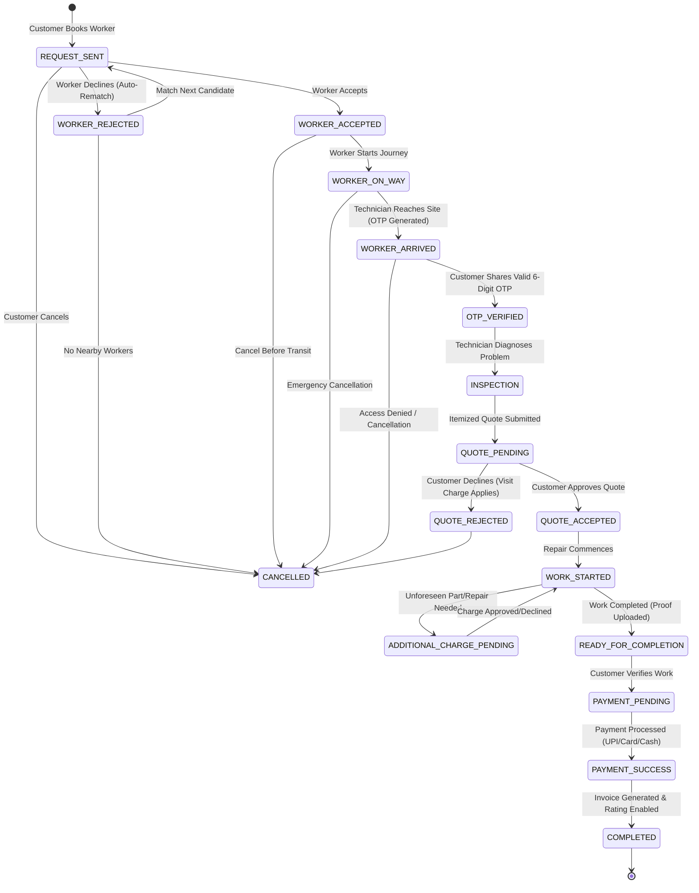

# SkillSync — System Architecture & Design

This document details the architectural foundation, data models, state machines, and security protocols of the SkillSync platform.

---

## 1. System Topology

```
+-------------------------------------------------------------------------+
|                              CLIENT APPS                                |
|  +-----------------------------------+  +----------------------------+  |
|  |     React Native Mobile App       |  |     Web Application        |  |
|  |    (Expo Router / TypeScript)     |  |    (Responsive SPA / JS)   |  |
|  +-----------------+-----------------+  +--------------+-------------+  |
+--------------------|-----------------------------------|----------------+
                     | REST API (HTTP/JSON + Media)      |
                     v                                   v
+-------------------------------------------------------------------------+
|                           FASTAPI BACKEND                               |
|                                                                         |
|  [ Auth & RBAC ]        [ State Machine ]      [ Match & Haversine ]    |
|  - Customer / Worker    - 16 Strict States     - Geolocation Radius     |
|  - Session Token Store  - Audit Event Logger   - Skill & Rating Rank    |
|                                                                         |
|  [ Media Storage ]      [ AI Diagnostics ]     [ Notification Engine ]  |
|  - Local FS / S3 API    - Vision + Text LLM    - In-App Queue           |
|  - Safe MIME Validator  - Heuristic Fallback   - Role-Based Delivery    |
+------------------------------------+------------------------------------+
                                     |
                                     v
+-------------------------------------------------------------------------+
|                           DATA PERSISTENCE                              |
|                           (MongoDB Motor)                               |
|                                                                         |
|  - users            - bookings          - booking_events   - media      |
|  - user_sessions    - problem_reports   - ai_analyses      - reviews    |
|  - addresses        - notifications     - support_cases    - earnings   |
+-------------------------------------------------------------------------+
```

---

## 2. Booking State Machine

The core lifecycle is governed by an immutable state transition graph. Any invalid transition immediately raises an HTTP 409 Conflict error.



---

## 3. Data Collections & Schemas

### `users`
- `user_id`: UUID hex string (`user_...`)
- `email`: User email address (unique)
- `name`: Full name
- `role`: `"customer"` | `"worker"`
- `phone`: Mobile phone (masked when shared)
- `worker_profile` (only for workers):
  - `skills`: Array of string competencies
  - `categories`: Array of supported category IDs
  - `experience_years`: Years in trade
  - `rating`: Float average rating (1.0–5.0)
  - `total_reviews`: Count of customer reviews
  - `completed_jobs`: Number of successfully finished bookings
  - `verification`: `"PENDING"` | `"VERIFIED"` | `"REJECTED"`
  - `online`: Boolean availability flag
  - `base_lat`, `base_lng`: Coordinates for geolocation matching
  - `service_radius_km`: Service radius limit

### `bookings`
- `id`: Unique booking identifier
- `booking_number`: Human-readable identifier (e.g. `SS-A93F2B`)
- `customer_id`, `worker_id`: Participant IDs
- `status`: Current state enum
- `category`, `service_name`: Service classification
- `address`: Formatted snapshot with GPS coordinates
- `scheduled_date`, `scheduled_time`: Appointment schedule
- `ai_estimate`: Snapshot of AI diagnostic range and confidence
- `otp`: 6-digit verification code (isolated from worker)
- `quote`: Itemized breakdown (`parts`, `labour`, `total`, `eta_minutes`)
- `additional_charges`: Array of change orders submitted during repair
- `progress`: Array of timeline log entries with before/after photos
- `payment`, `invoice`: Transaction receipt and itemized tax invoice
- `review`: Star rating and customer commentary

---

## 4. Security & Privacy Guarantees

1. **OTP Isolation**: The 6-digit start OTP is generated on the server when the technician marks `WORKER_ARRIVED`. The OTP value is stripped from all worker-facing payloads (`booking_payload`), preventing bypass.
2. **Role-Based Authorization**: Every protected endpoint enforces strict role verification (`require_user(request, role="customer")` or `role="worker"`).
3. **Phone Privacy**: Phone numbers are masked across all client interfaces (`+91 98XXX XX10`) to eliminate unsolicited off-platform contact.
4. **Audit Trail**: Every change in booking status or payment logs an immutable record in `booking_events` with the actor ID, timestamp, and metadata diff.
